##Tutorial  Javier Usobiaga / Domestika

### Diseño, desarrollo y publicación de una página web

# 1. Introducción:
# 2. Ideación de una web:
# 3. Diseño visual:
# 4. Sistema de plantillas:

# 1. Introducción:

Páginas web que recomiendo
Sarah Drasner
Diseñadora, desarrolladora frontend y divulgadora que escribe artículos y libros sobre temas como JavaScript o animaciones SVG.

Jen Simmons
Designer advocate para la Fundación Mozilla.

Lynn Fisher
Diseñadora, desarrolladora web y artista digital.

Rachel Andrew
Desarrolladora frontend de UK y miembro del CSS Working Group.

Sara Soueidan
Desarrolladora web de Líbano que realiza divulgación sobre frontend, especialmente de SVG y de accesibilidad.

Una Kravets
Directora de diseño de producto y desarrolladora web de EEUU.

Codepen de Ana Tudor
Perfil de la desarrolladora web Ana Tudor en la web de Codepen.

Miriam Suzanne
Desarrolladora web, diseñadora y artista.

# 2. Ideación de una web:

###-Inventario de Interfaz:
Que elementos informaticos hay en nuestra pagina.
Sirve para planificar el rediseño de una interfaz.
Se organiza por categorias como tipografia, navegación, imagenes, iconos.

###-Inventario de contenidos: 
Un listado textual de los elementos que tendra la interfaz. ( lista formato texto).
Sirve para organizar y planificar la estructura de una web.
Se puede usar Trello para esto. Asi se tiene claro los elemtos que tienen que aparecer en la web.

###-Card sorting:
Distribuir los elementos o ideas en grupos para crear una navegacion intiutiva.
Crear unidades tematicas por ejemplo Layout, contacto, las otras páginas.

--------
###- Arquitectura de la información:

-WireFrames: sirven para planificar la distribución de la información.

a. Vista de pajaro: diseñar a grandes rasgos la como sería la interaccion en general de la web entre sus diferentes paginas.
Como se moveria el usuario en la web y que elementos de interfaz encuentra.

b. Detalle de página: una página en concreto y se definen los elementos informaticos.

c.Mockup: diseño mas visual donde se crea una composición de como se va a ver la página.

d.Prototipo Interactivo: elementos interactivos en el wireframes.

# 3. Diseño visual:

## A.Principios diseño visual:

###Principios que transmiten unidad o armonía en un diseño:

-Proximidad : 
La distancia relativa entre un conjunto de elementos hace que estos parezcan de una misma unidad.
[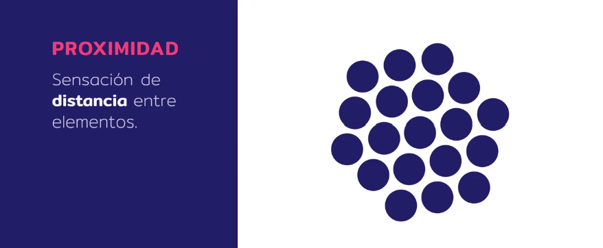](./img/proximidad.png)

-Similaridad :
Aquellos elementos que por sus caracteristicas parecen similares a otros, se perciben como una unidad.
[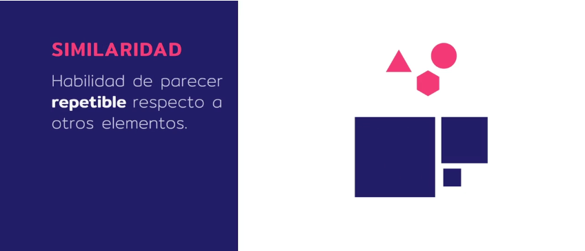](./img/similaridad.png)

-Continuacion:
Es la sensacion de que un conjunto de elementos se extiende a lo largo de una linea o un patron.
[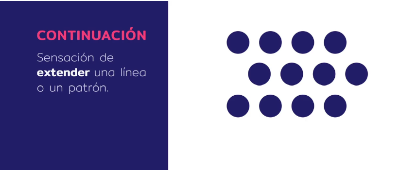](./img/continuacion.png)

-Repeticion:
un elemento copiado varias veces.
[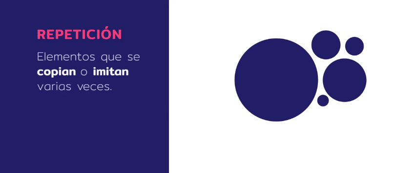](./img/repeticion.png)

-Ritmo:
Cuando una posicion, tamaño, color o elemento recurrente se interrumpe en un punto focal.
[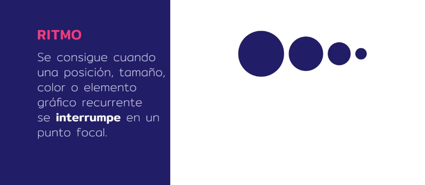](./img/ritmo.png)

###Principios que transmiten equilibrio en un diseño:

-Simetria:
Los elementos estan dispuestos de forma similar a ambos lados del eje.
[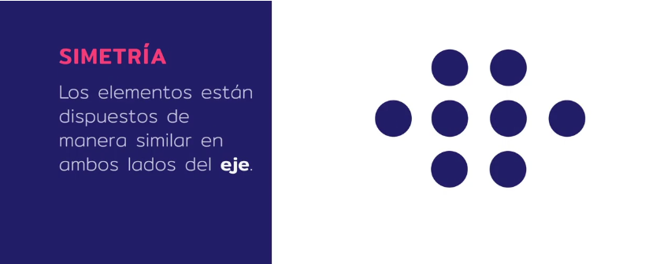](./img/simetria.png)

-La asimetria Equilibrada:
en la cual los elementos de ambos lados del eje tiene formas distintas, pero estan equilibradas visualmente.
[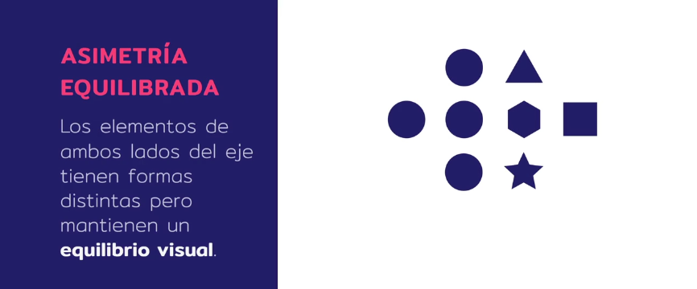](./img/asimetria.png)

-Disposicion radial:
Los elementos se distribuyen de forma circular.
[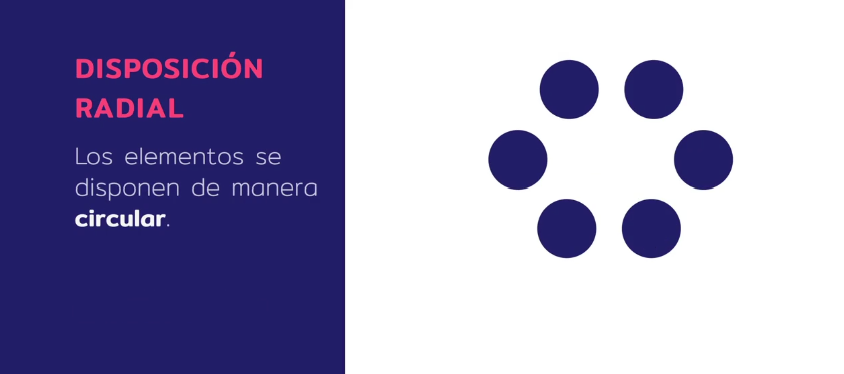](./img/radial.png)

###Principios que transmiten jerarquia en un diseño:

-Peso:
Dos elementos con el mismo peso pertenecen al mismo tipo de posicion jerarquica.
[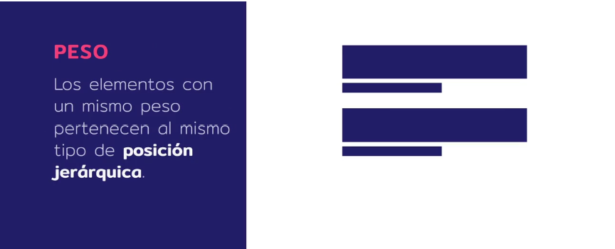](./img/peso.png)

-Escala:
La relacion de tamaños entre los diferentes elementos transmite una jerarquia determinada.
[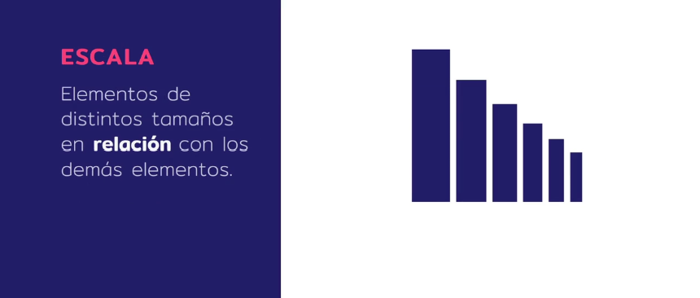](./img/escala.png)

-Divisiones:
Las divisiones, sea a través del espaciado, el color u otras tecnicas, crean puntos focales a partir de los cuales se puede deducir que elementos forman parte de una unidad informativa.
[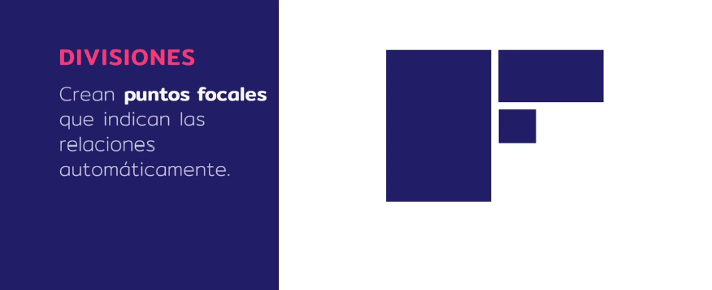](./img/divisiones.png)

###Principios que guían la vista en un diseño:
Son clave para orientar al usuario y para organizar la lectura de la informacion en una interfaz.

-Enfasis:
Si rompemos la jeraquia visual utilizando la forma, estamos generando un punto de atencion por la diferencia y automaticamente los ojos se van al elemento que es diferente dentro de esta unidad visual.
[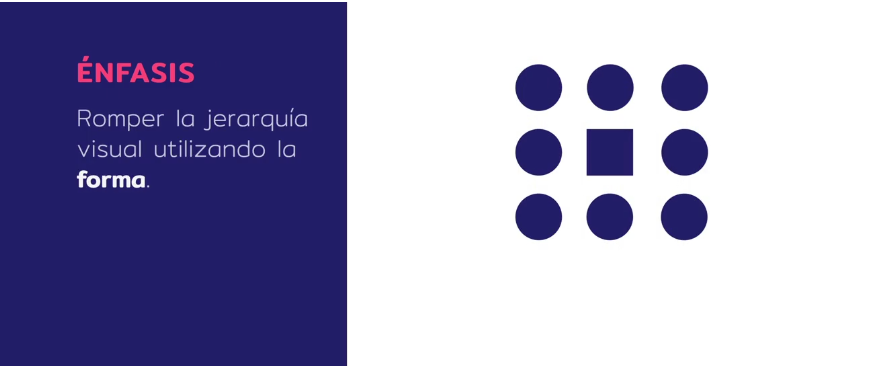](./img/enfasis.png)

-Color:
Un color difrente de la unidad informativa hace que nuestros ojos se vayan a ese punto y por lo tanto entendemos que tiene mucha mas importancia.
[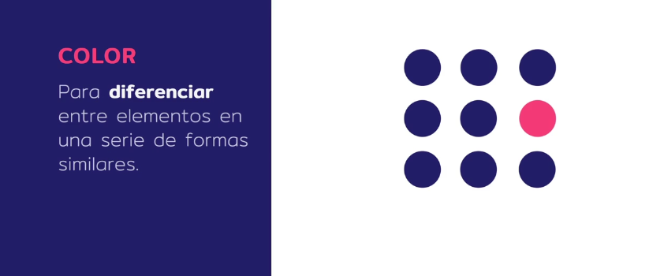](./img/color.png)

-Tamaño:
El elemento mas grande en esta composicion es el que mas atrae la atencion y por lo tanto nos esta indicando que es el elemento con mas importancia dentro de este conjunto.
[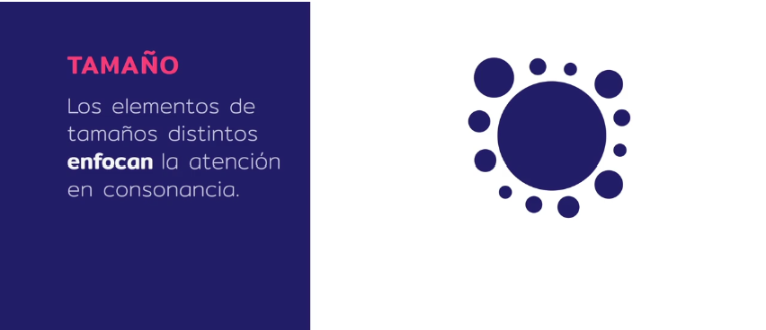](./img/tamaño.png)

-Contraste:
Si separamos los elementos entre un fondo claro y un primer plano oscuro, los elementos en ese primer plano son mas importantes o estan destacados respecto a los que estan en el fondo.

-La linea:
Los elementos con diferentes texturas o formas generaran un efecto de contraste y dirigiran la direccion de la vista de una direccion u otra.
[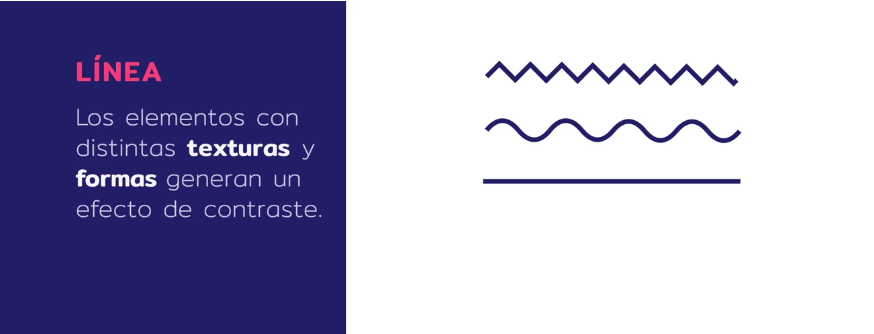](./img/linea.png)

## B.Investigación visual :

[Ejemplo 1: SNAPSOUND ](https://www.snapsound.com/)
[Ejemplo 2: MOKARIKO ](https://www.mokarico.com/en/)
[Ejemplo 3: ATLASSIAN ](https://www.atlassian.com/time-wasting-at-work-infographic)

###Lugares para tomar referencias:

-Galería Dribbble:
Galería de diseño gráfico Dribbble.
[Galería Dribbble](https://dribbble.com/)

-Galería Awwwards:
Galería de páginas web Awwwards.
[Galería Awwwards](https://www.awwwards.com/)

###Moodboard: 
una composicion o un collage en el cual mostramos fotos, tipografias, paleta de color que podrian encajar con el lenguaje que estamos buscando.

-Aplicación Notion sirve para recolectar referencias y una investigacion visual.
Aplicación de organización de notas Notion.

[Galería Awwwards](https://www.notion.so/)

## C.Composición tipográfica :

-Las tipografias tienen varias familias y estilos.
Los dos grandes grupos son con remates (serif) y sin remates (sans-serif).

La receta de combinacion de tipografias mas facil es la combinacion de una tipografia con remates y una sin remates. Ejemplo: Remate en los titulares y sin remate en el cuerpo.

[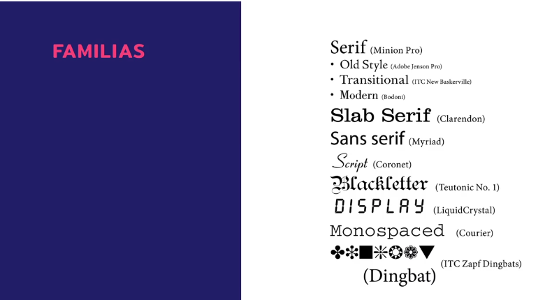](./img/tipografias.png)

Google Fonts:
Directorio de fuentes.
[Google Fonts](https://fonts.google.com/)

ejemplo fuentes: Abril Fatface / Raleway

- Escala tipografica:
marcar titulos principales, secundarios y el texto.

[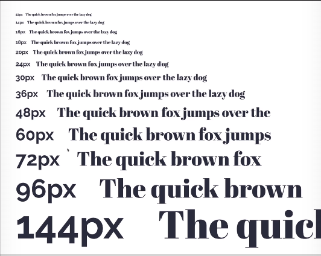](./img/escalaTipo.png)

Escala tipografica para desktop: (1200 - 1400PX)
[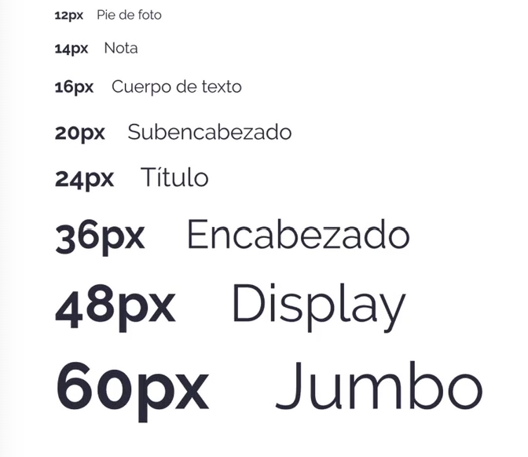](./img/tiposeleccion.png)

Escala tipografica para movil: ( 400PX)

[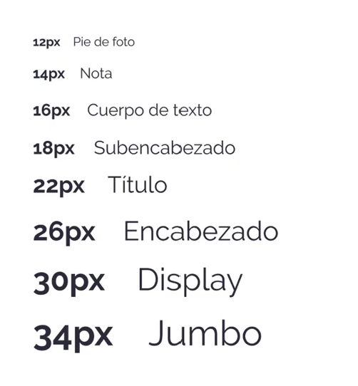](./img/escalaMovil.png)

## D.Paleta de colores en una interfaz 

Las interfaces emplean paletas para conseguir consistencia y armonia.

Como aplicar la paleta:

Si solo fuesen los colores seleccionados:

Para hacer un diseño mas adecuado toca añadir colores intermedios. Entre ellos varios tonos grises ( 10 aprox) y contar con uno o dos colores primarios (10 variaciones) y colores de acento.

[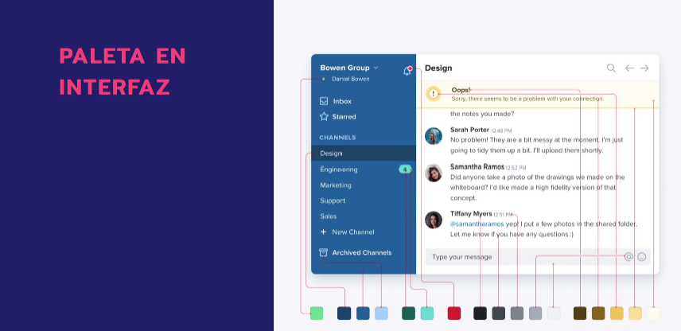](./img/interfazColorIntermedios.png)

Grises:

Primarios:
[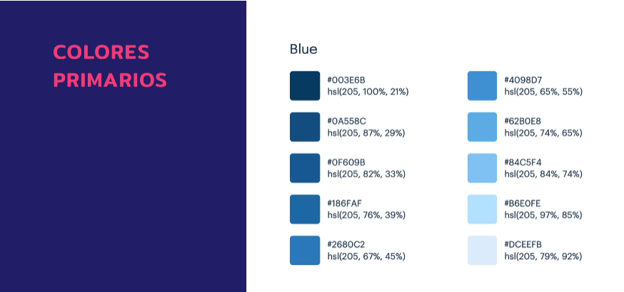](./img/primarios.png)

Acento: Tienen la funcion de llamar la atencion.
[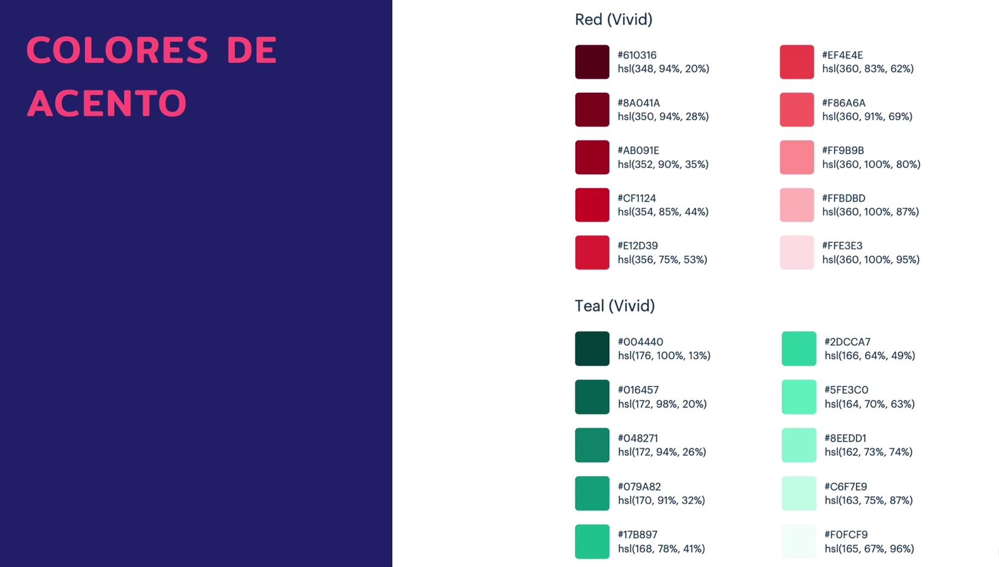](./img/acento.png)

-Color:

[Adobe Color](https://color.adobe.com/sv/create/color-wheel)
Rueda de colores y generador de paletas de Adobe.

[Colour Lovers](https://www.colourlovers.com/)
Galería de paletas de colores.

[Cohesive Colors](https://javier.xyz/cohesive-colors/)
Herramienta de armonización de paletas.

[0to255](https://0to255.com/)
Generador de variantes de color.

[ColorBox](https://lyft-colorbox.herokuapp.com/)

## E.Retícula y ritmo vertical

Una reticula permite crear armonia y legibilidad.

- 12 columnas:

[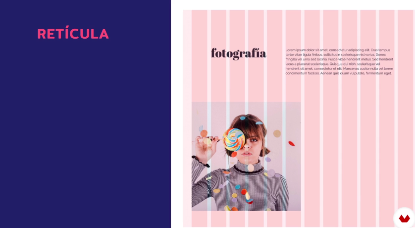](./img/12columnas.png)

- Marcar los espaciados que hay dentro de la pagina de margenes verticales.

[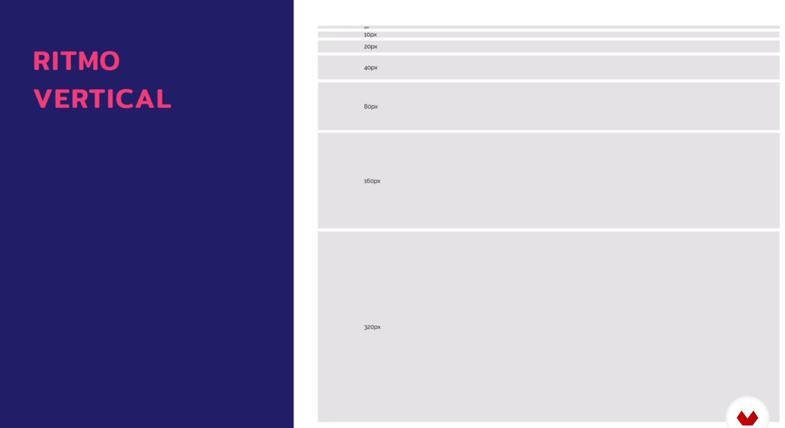](./img/espacios.png)
[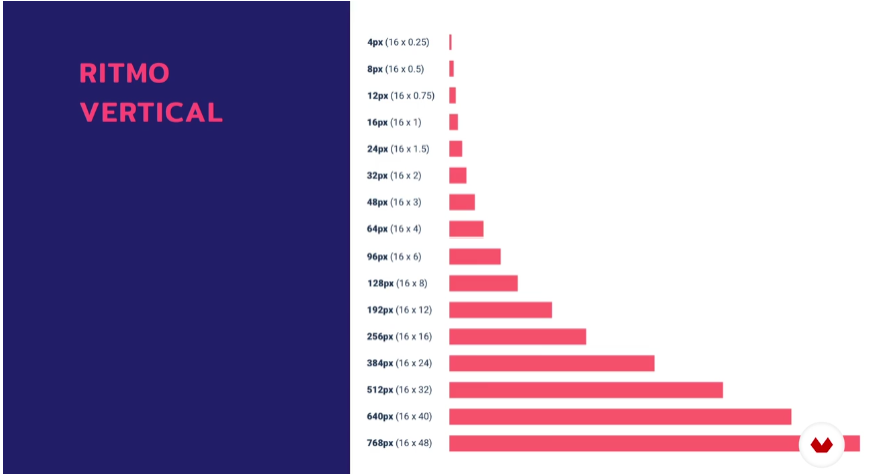](./img/ritmovertical.png)

## F.Ilustración e iconografía

La fotografia/ilustracion da informacion no verbal y emocional.
La iconografia facilita la legibilidad.

[Ejemplo 1: PATAGONIA ](https://eu.patagonia.com/)

[Unsplash](https://unsplash.com/)
Web de fotografías libres de derechos.

-Iconos
Familia de iconos:
[Iconic](https://useiconic.com/icons/)
[Feather](https://feathericons.com/)
[Fontawesome](https://fontawesome.com/)
[Orion](https://orioniconlibrary.com/)

# 4. Sistema de plantillas:

## A. Generadores de HTML y editores de codigo:

Generador de HTML estatico que nos permite crear y reutilizar plantillas mas optimizar como escribimos el codigo html ( basado en Ruby).
[Middleman](https://middlemanapp.com/)

[HUGO](https://gohugo.io/) Basado en el lenguaje Go.

[Jekyll](https://jekyllrb.com/) Basado en Ruby.

Página principal del generador de HTML estático 11ty.
[Web de 11ty](https://www.11ty.dev/) Basado en Node.

-Terminal:

Cygwin (Windows)
[Cygwin](https://www.cygwin.com/) 
Programa de terminal para Windows.

iTerm2 (Mac)
[iTerm2 ](https://iterm2.com/)
Programa de terminal para macOS.

-Editores de codigo gratuito:

Brackets
[Brackets](https://brackets.io/)
Editor de código Brackets.

Atom
[Atom](https://atom.io/)
Editor de código Atom.

VS Code
[VS Code](https://code.visualstudio.com/)
Editor de código Visual Studio Code.

## B. Estructura de archivos y funcionamiento:

Abrir el proyecto en el editor de codigo (que bajamos de domestika) y en la terminal Cygwin:

npm i
npm run dev

entrar al servidor/ para pararlo control C

NJK es el lenguaje de plantillas de Nunjucks ( los archivos del proyecto tienen esa extension que use 11ty)
[NUNJUCKS](https://mozilla.github.io/nunjucks/)

## C. Páginas maestras y creación de nuevas páginas:

